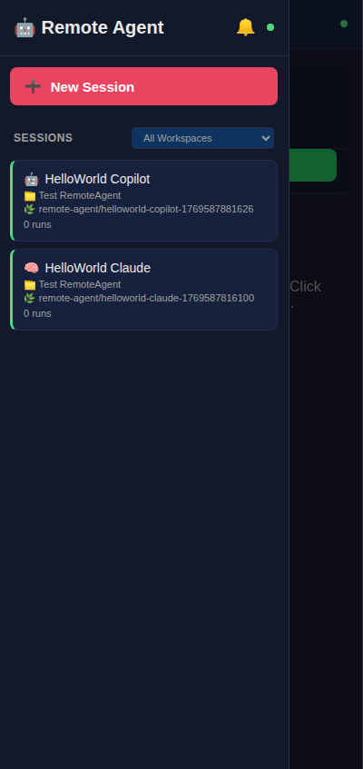
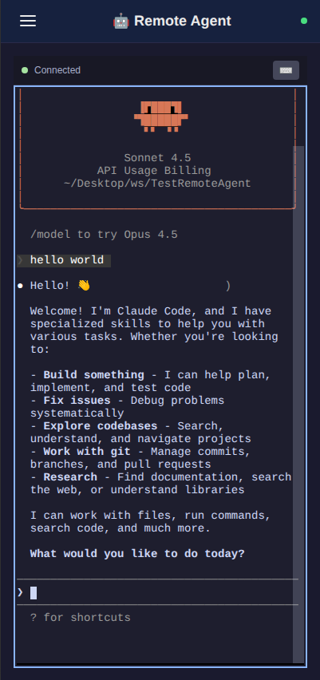
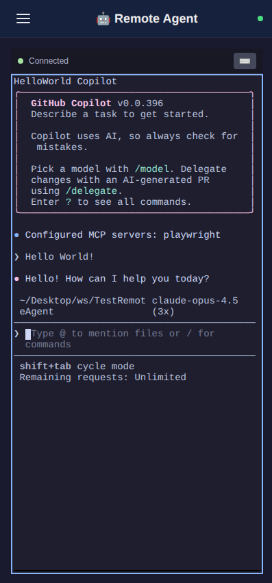

<h1 align="center">RemoteAgent</h1>

<p align="center">
  <strong>Run AI coding agents from everywhere</strong>
</p>

<p align="center">
  <em>A mobile-friendly web control panel for Claude Code and GitHub Copilot CLI</em>
</p>

<p align="center">
  
  &nbsp;&nbsp;
  
  &nbsp;&nbsp;
  
</p>

<p align="center">
  <a href="#-features">Features</a> |
  <a href="#-quick-start">Quick Start</a> |
  <a href="#-docker-deployment">Docker</a> |
  <a href="#-remote-access">Remote Access</a> |
  <a href="#-configuration">Configuration</a>
</p>

<p align="center">
  
  
  
</p>

<p align="center">
  
  
  
  
</p>

---

**RemoteAgent** gives you a full interactive terminal to your AI coding agents from anywhere. Start a coding session on your desktop, continue it from your phone while grabbing coffee, and get push notifications when the agent needs your input.

## Features

| Feature | Description |
|---------|-------------|
| **Interactive Terminal** | Full PTY terminal in your browser - type commands, respond to prompts, see real-time output |
| **Mobile-First PWA** | Designed for laptop, phones and tablets |
| **Session Persistence** | Stop and resume conversations anytime |
| **Push Notifications** | Get notified when the agent needs input or finishes |
| **Docker Sandboxing** | Network-filtered container with domain allowlisting |
| **Multi-Agent** | Seamlessly switch between Claude Code / GitHub Copilot sessions |

## Quick Start

```bash
# Clone and install
git clone https://github.com/josecisneros001/RemoteAgent.git
cd RemoteAgent
npm install && cd src/client && npm install && cd ../..

# Configure (add your project paths)
mkdir -p ~/.remote-agent
cp config.example.json ~/.remote-agent/config.json

# Run
npm run dev
```

Open **http://localhost:3000** - Select workspace - Choose agent - Start coding!

## Docker Deployment

For **secure sandboxed execution** with network filtering:

```bash
cd docker

# Edit docker-compose.yml to set your workspace path
# Change: ~/your/projects/folder:/workspace

# Build and run (matches your host user for file permissions)
HOST_UID=$(id -u) HOST_GID=$(id -g) docker compose up --build
```

### Network Security

Docker mode provides DNS-based network filtering:

- **Allowlisted domains only** - agents can only reach approved APIs
- **Blocks SSH/FTP/SMTP** - prevents data exfiltration
- **Hot-reload allowlist** - edit docker/allowlist.json without restart (requires admin/sudo)

```bash
# Make allowlist editable only by admin (prevents AI from modifying it)
sudo chown root:root docker/allowlist.json
sudo chmod 644 docker/allowlist.json
```

## Remote Access

Access RemoteAgent from your phone or any device:

### Microsoft Dev Tunnels (Recommended)

Dev Tunnels provides **built-in authentication** — only you can access the tunnel using your Microsoft/GitHub account. No random URLs that anyone could stumble upon.

```bash
# Install Dev Tunnels CLI
curl -sL https://aka.ms/DevTunnelCliInstall | bash

# Login (uses your GitHub or Microsoft account)
devtunnel user login

# Start tunnel (use the included script)
npm run tunnel
```

The tunnel URL stays the same across restarts, and requires your account to access.

### Other Options
Cloudflare Tunnel / ngrok


## Configuration

Config file: ~/.remote-agent/config.json

```json
{
  "workspaces": [],
  "defaultBrowsePath": "/home/user/projects",
  "port": 3000
}
```

| Option | Description |
|--------|-------------|
| defaultBrowsePath | Default folder when adding new workspaces |
| port | Server port (default: 3000) |

## Prerequisites

**Required:**
- Node.js 18+
- One of: [Claude Code](https://docs.anthropic.com/en/docs/claude-code) or [GitHub Copilot CLI](https://githubnext.com/projects/copilot-cli)

**Install Claude Code:**
```bash
npm install -g @anthropic-ai/claude-code
claude auth
```

**Install GitHub Copilot CLI:**
```bash
npm install -g @github/copilot
copilot login
```

## Project Structure

```
RemoteAgent/
├── src/
│   ├── server/              # Fastify + WebSocket backend
│   │   ├── services/
│   │   │   ├── pty-manager.ts   # Interactive terminal (node-pty)
│   │   │   ├── git.ts           # Branch/commit management
│   │   │   └── push.ts          # Push notifications
│   │   └── routes/api.ts        # REST endpoints
│   └── client/              # React 19 + Vite frontend
│       └── src/components/
│           ├── InteractiveTerminal/  # xterm.js terminal
│           ├── SessionList/
│           └── NewSessionForm/
├── docker/                  # Docker + network filtering
│   ├── Dockerfile
│   ├── docker-compose.yml
│   ├── allowlist.json       # Allowed domains
│   └── entrypoint.sh        # dnsmasq + iptables setup
└── package.json
```

## Development

```bash
# Development with hot reload
npm run dev

# Watch both server and client
npm run watch

# Production build
npm run build && npm start
```

## Contributing

Contributions are welcome! Please feel free to submit a Pull Request.

1. Fork the repository
2. Create your feature branch (git checkout -b feature/amazing-feature)
3. Commit your changes (git commit -m 'Add amazing feature')
4. Push to the branch (git push origin feature/amazing-feature)
5. Open a Pull Request

## License

MIT License - see [LICENSE](LICENSE) for details.

---

<p align="center">
  <strong>Built for developers who code on the go</strong>
</p>

<p align="center">
  <a href="https://github.com/josecisneros001/RemoteAgent/issues">Report Bug</a> |
  <a href="https://github.com/josecisneros001/RemoteAgent/issues">Request Feature</a>
</p>
