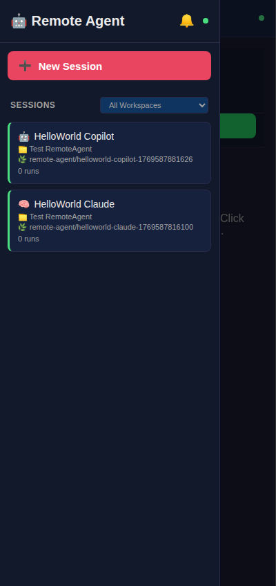
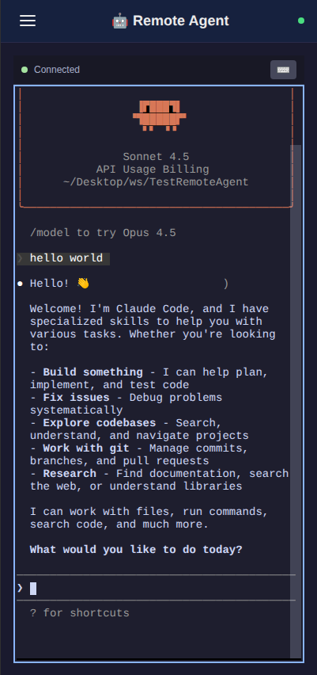
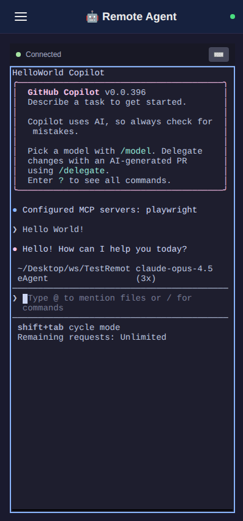

<h1 align="center">RemoteAgent</h1>

<p align="center">
  <strong>Run AI coding agents from everywhere</strong>
</p>

<p align="center">
  <em>A mobile-friendly web control panel for Claude Code and GitHub Copilot CLI</em>
</p>

<p align="center">
  
  &nbsp;&nbsp;
  
  &nbsp;&nbsp;
  
</p>

<p align="center">
  <a href="#features">Features</a> |
  <a href="#prerequisites">Prerequisites</a> |
  <a href="#quick-start">Quick Start</a> |
  <a href="#docker-deployment">Docker</a> |
  <a href="#remote-access">Remote Access</a> |
  <a href="#configuration">Configuration</a>
</p>

<p align="center">
  
  
  
</p>

<p align="center">
  
  
  
  
</p>

---

**RemoteAgent** gives you a full interactive terminal to your AI coding agents from anywhere. Start a coding session on your desktop, continue it from your phone while grabbing coffee, and get push notifications when the agent needs your input.

## Features

| Feature | Description |
|---------|-------------|
| **Interactive Terminal** | Full PTY terminal in your browser - type commands, respond to prompts, see real-time output |
| **Mobile-First PWA** | Designed for laptops, phones, and tablets |
| **Session Persistence** | Stop and resume conversations anytime |
| **Push Notifications** | Get notified when the agent needs input or finishes |
| **Docker Sandboxing** | Network-filtered container with domain allowlisting |
| **Multi-Agent** | Seamlessly switch between Claude Code and GitHub Copilot sessions |

## Prerequisites

Install only what you need based on how you plan to run RemoteAgent:

### Node.js 18+ (required for native mode)

Skip this if you're using Docker only.

```bash
# Check if already installed
node --version   # Should print v18.x or higher

# Install via nvm (recommended)
curl -o- https://raw.githubusercontent.com/nvm-sh/nvm/v0.40.0/install.sh | bash
nvm install 20

# Or download directly from https://nodejs.org
```

### Claude Code CLI

Required if you want to use Claude as your AI agent.

```bash
npm install -g @anthropic-ai/claude-code

# Authenticate (opens browser)
claude
# Then type: /login
```

You need a [Claude Pro, Max, or Team subscription](https://claude.ai/pricing), or an [Anthropic API key](https://console.anthropic.com/).

See the [Claude Code documentation](https://docs.anthropic.com/en/docs/claude-code) for more details.

### GitHub Copilot CLI

Required if you want to use Copilot as your AI agent.

```bash
npm install -g @github/copilot

# Authenticate
copilot
# Then type: /login
```

You need a [GitHub Copilot subscription](https://github.com/features/copilot).

### Docker & Docker Compose (Docker mode only)

Required only if you want to run RemoteAgent inside a container with network sandboxing.

```bash
# Check if already installed
docker --version
docker compose version

# Install Docker Desktop (Windows/Mac): https://www.docker.com/products/docker-desktop
# Install Docker Engine (Linux): https://docs.docker.com/engine/install/
```

### Microsoft Dev Tunnels (optional, for remote access)

Only needed if you want to access RemoteAgent from your phone or another device outside your local network.

```bash
# Linux/macOS
curl -sL https://aka.ms/DevTunnelCliInstall | bash

# Windows
winget install Microsoft.devtunnel

# Authenticate with your GitHub or Microsoft account
devtunnel user login -g
```

## Quick Start

### Native Mode

Run RemoteAgent directly on your machine. Requires Node.js 18+ and at least one CLI agent installed.

```bash
# 1. Clone the repository
git clone https://github.com/josecisneros001/RemoteAgent.git
cd RemoteAgent

# 2. Install dependencies
npm run install:all

# 3. Start in development mode
npm run dev
```

Open **http://localhost:3000** in your browser. From there:
1. Add a workspace (point it to a project directory on your machine)
2. Create a new session - choose Claude or Copilot as the agent
3. Type a prompt and start coding

For production use:

```bash
npm run build
npm start
```

### Docker Mode

Run RemoteAgent in a sandboxed container with network filtering. The container only allows outbound traffic to approved domains, preventing AI agents from accessing unauthorized resources.

**Step 1: Clone and configure**

```bash
git clone https://github.com/josecisneros001/RemoteAgent.git
cd RemoteAgent/docker
```

Edit `docker-compose.yml` to set your workspace path:

```yaml
volumes:
  # Change this to your project directory
  - ~/your/projects/folder:/workspace
```

**Step 2: Set up CLI authentication on your host**

The container mounts your host CLI credentials so you don't need to re-authenticate inside Docker.

For **Claude Code**, make sure you've run `claude` and authenticated on your host machine. The container reads from:
- `~/.claude.json` (auth token)
- `~/.claude/` (session data - mapped from `~/.claude-docker/` to avoid conflicts)
- `~/.claude/settings.json` (auto-copied and adapted for Docker)

For **GitHub Copilot**, authenticate on your host first. The container reads from:
- `~/.copilot-docker/` (Copilot session data)
- `~/.config/github-copilot/` (auth config)

**Step 3: Build and run**

```bash
# Build and start the container (match your host user for file permissions)
HOST_UID=$(id -u) HOST_GID=$(id -g) docker compose up --build
```

The container includes a **Dev Tunnel sidecar** that automatically exposes RemoteAgent for remote access. On first run, the tunnel service will print setup instructions to authenticate (one-time):

```bash
# One-time: login to Dev Tunnels inside the container
docker compose build
docker compose run --rm --entrypoint "" tunnel devtunnel user login -g -d

# Then start everything
docker compose up -d
```

The tunnel auto-starts with the app on every `docker compose up` and persists across reboots (`restart: unless-stopped`). To run the app without the tunnel:

```bash
docker compose up remote-agent
```

**Step 4: Verify**

Open **http://localhost:3000** and create a session. Check the container logs if anything goes wrong:

```bash
docker compose logs -f
```

#### Docker Volume Reference

| Volume Mount | Purpose |
|---|---|
| `~/your/projects/folder:/workspace` | Your project files (the AI agent works here) |
| `./allowlist.json:/app/allowlist.json` | Allowed domains for network filtering (hot-reload) |
| `~/.claude.json:/home/agent/.claude.json` | Claude Code authentication token |
| `~/.claude-docker/:/home/agent/.claude/` | Claude Code session data |
| `~/.claude/settings.json:/tmp/claude-settings.json:ro` | Claude settings (auto-adapted for Docker) |
| `~/.copilot-docker:/home/agent/.copilot` | Copilot CLI session data |
| `~/.config/github-copilot:/home/agent/.config/github-copilot` | Copilot authentication config |
| `~/.remote-agent-docker:/home/agent/.remote-agent` | RemoteAgent data (sessions, config) |
| `./logs:/var/log/dns` | DNS filter logs (optional, for debugging) |
| `tunnel-auth` (Docker volume) | Dev Tunnel auth tokens (persisted across restarts) |

#### Network Filtering

Docker mode uses DNS-based filtering to restrict outbound network access:

- **dnsmasq** resolves only domains listed in `docker/allowlist.json`
- **iptables** blocks external DNS, FTP, SSH, and SMTP traffic
- HTTP and HTTPS traffic is allowed only to resolved (allowlisted) domains

**Managing the allowlist:**

```bash
# Edit the allowlist (changes apply automatically via hot-reload)
nano docker/allowlist.json
```

The default allowlist includes domains for Claude API, GitHub/Copilot API, common package registries (npm, PyPI, crates.io), and documentation sites.

To secure the allowlist so the AI agent can't modify it:

```bash
sudo chown root:root docker/allowlist.json
sudo chmod 644 docker/allowlist.json
```

To disable network filtering entirely, set in `docker-compose.yml`:

```yaml
environment:
  - ENABLE_NETWORK_FILTER=false
```

## Remote Access

Access RemoteAgent from your phone or any device outside your local network.

### Docker Mode (built-in)

If you're running Docker, the tunnel sidecar is included in `docker-compose.yml` and starts automatically. See [Docker Mode](#docker-mode) above for setup.

### Native Mode (Dev Tunnels)

Dev Tunnels provides **built-in authentication** - only you can access the tunnel using your Microsoft or GitHub account. Each machine gets its own persistent tunnel URL (named `remote-agent-<hostname>`).

```bash
# Make sure you've authenticated (see Prerequisites)
devtunnel user login -g

# Start the tunnel
# Linux/macOS:
npm run tunnel

# Windows:
npm run tunnel:win
```

Override the tunnel name with the `TUNNEL_NAME` environment variable:

```bash
TUNNEL_NAME=my-custom-name npm run tunnel
```

### Other Tunneling Services

Any HTTPS tunneling service works with RemoteAgent. If you prefer [Cloudflare Tunnel](https://developers.cloudflare.com/cloudflare-one/connections/connect-networks/), [ngrok](https://ngrok.com/), or another service, just point it at `localhost:3000`. Note that unlike Dev Tunnels, most alternatives require you to configure your own authentication to prevent unauthorized access.

## Configuration

RemoteAgent stores its configuration at `~/.remote-agent/config.json`. This file is created automatically on first run. Workspaces are typically managed through the UI, but you can also edit the file directly.

```json
{
  "workspaces": [],
  "defaultBrowsePath": "~/",
  "port": 3000
}
```

| Option | Type | Default | Description |
|--------|------|---------|-------------|
| `workspaces` | Array | `[]` | Registered project directories. Each entry has `id`, `name`, and `path`. Typically managed through the UI. |
| `defaultBrowsePath` | String | home directory | Default folder shown when browsing for new workspaces in the UI. |
| `port` | Number | `3000` | Port the server listens on. |

> Push notification keys (`vapidPublicKey`, `vapidPrivateKey`) are auto-generated on first start — you never need to set these manually.

### Push Notifications

RemoteAgent sends push notifications when the AI agent needs your input — so you can step away from the screen and get alerted on your phone or any subscribed device.

**How it works:**
- **Claude sessions** use Claude CLI's built-in Notification hook for reliable detection (auto-configured per session)
- **Copilot sessions** use idle-time heuristics (8 seconds of inactivity triggers a notification)

**Setting up notifications:**
1. Open RemoteAgent in your browser (on each device you want notifications on)
2. Click the 🔔 bell icon in the sidebar to open Notification Settings
3. Click **Subscribe** and allow notifications when prompted
4. Your device is automatically named (e.g., "Chrome on Windows", "Safari on iOS")

**Managing devices:**

The Notification Settings modal lets you manage all subscribed devices:
- **Test** — send a test notification to verify delivery
- **Rename** — give devices friendly names
- **Delete** — remove devices you no longer use

Stale subscriptions (e.g., from a browser you uninstalled) are automatically cleaned up when push delivery fails.

**iOS note:** On iOS, push notifications require installing RemoteAgent as a PWA first. Tap the Share button in Safari → **Add to Home Screen**, then open from the Home Screen and subscribe.

**VAPID keys** are generated automatically on first server start — no manual setup needed.

## Project Structure

```
RemoteAgent/
├── src/
│   ├── server/              # Fastify + WebSocket backend
│   │   ├── services/
│   │   │   ├── pty-manager.ts   # Interactive terminal (node-pty)
│   │   │   ├── git.ts           # Branch/commit management
│   │   │   └── push.ts          # Push notifications
│   │   └── routes/api.ts        # REST endpoints
│   └── client/              # React 19 + Vite frontend
│       └── src/components/
│           ├── InteractiveTerminal/  # xterm.js terminal
│           ├── SessionList/
│           └── NewSessionForm/
├── docker/                  # Docker + network filtering
│   ├── Dockerfile
│   ├── docker-compose.yml
│   ├── allowlist.json       # Allowed domains
│   └── entrypoint.sh        # dnsmasq + iptables setup
└── package.json
```

## Development

```bash
# Development with hot reload (server only)
npm run dev

# Watch both server and client with hot reload
npm run watch

# Production build
npm run build && npm start
```

## Contributing

Contributions are welcome! Please feel free to submit a Pull Request.

1. Fork the repository
2. Create your feature branch (`git checkout -b feature/amazing-feature`)
3. Commit your changes (`git commit -m 'Add amazing feature'`)
4. Push to the branch (`git push origin feature/amazing-feature`)
5. Open a Pull Request

## License

MIT License - see [LICENSE](LICENSE) for details.

---

<p align="center">
  <strong>Built for developers who code on the go</strong>
</p>

<p align="center">
  <a href="https://github.com/josecisneros001/RemoteAgent/issues">Report Bug</a> |
  <a href="https://github.com/josecisneros001/RemoteAgent/issues">Request Feature</a>
</p>
